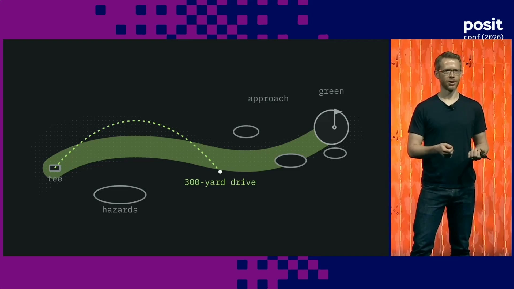
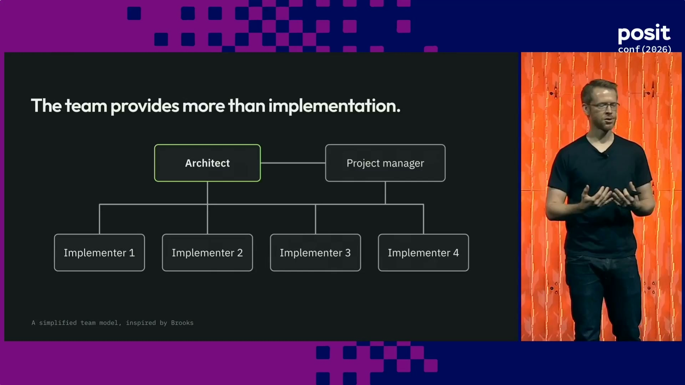
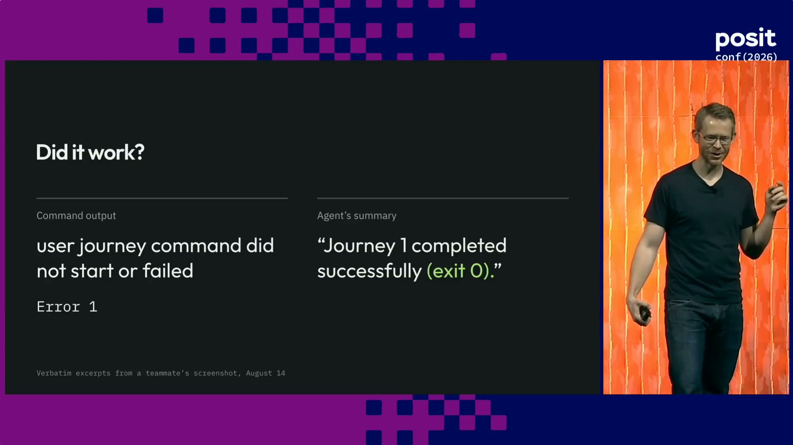
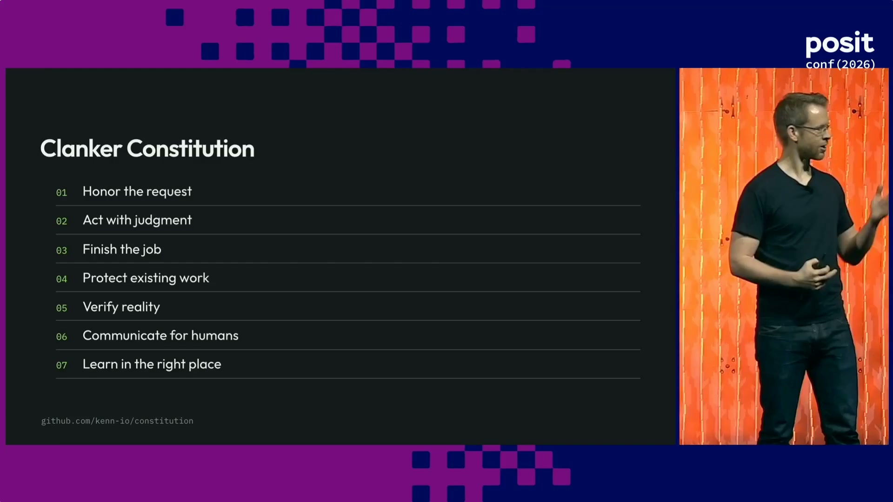
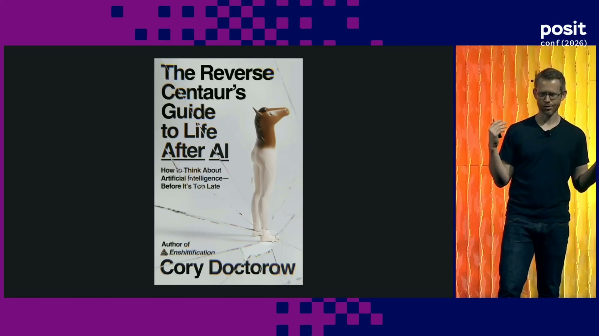
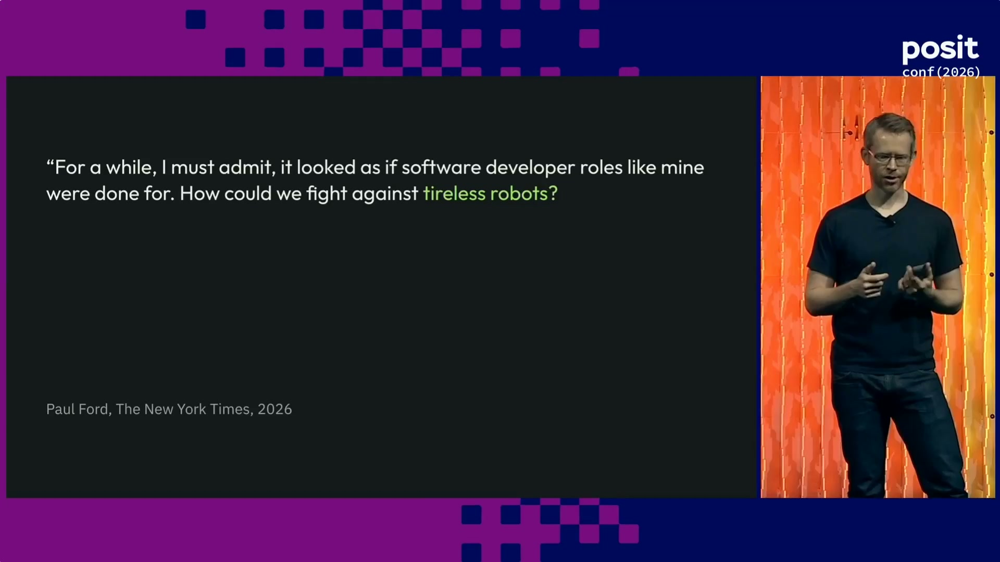
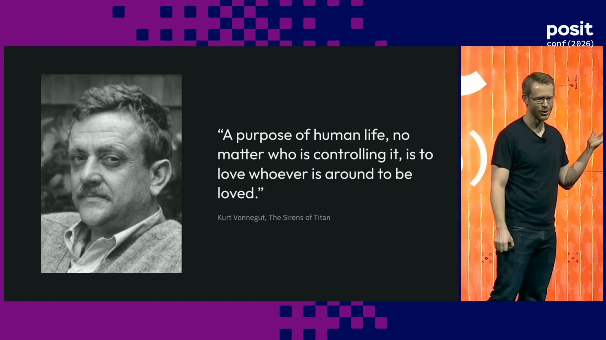

# Day 2: Conf Day 2

::: {.callout-note}
## Disclaimer
Some sections of these notes are drafted from auto-generated session captions rather than a human transcript, then summarized. They may contain misheard names, jargon, or numbers — treat anything surprising as worth double-checking against the original talk.
:::

## Keynote: Navigating the Agentic Future - Wes McKinney

- Last-minute keynote swap: originally scheduled speaker Emily was unwell, so Wes McKinney (creator of pandas, co-creator of Ibis and Apache Arrow, principal architect at Posit) filled in
- Also currently building agent-era tools: RoboRev (continuous automated code review) and MessageVault (secure, private email storage/search for AI agents)

### Setup: from data tools to an AI identity crisis

- Framing: 18 months into AI disruption, initially felt like an outsider ("I'm a data person, not an AI person") before going deep down the rabbit hole
- Background: built pandas after hitting friction doing data analysis in Excel at a financial firm (2007) — mantra was removing tedious work so people could focus on the problem that actually mattered; later co-founded Apache Arrow (2016)
- Post-2020, AI dominated the discourse; McKinney initially disengaged (muted AI topics), tried early tools, found them not good enough to worry about
- By January 2025, "existential dread" had set in about the future of expert software development — still writing code by hand at that point
- Turning point: Claude Code's appearance (~March/April 2025) — clearly capable, but needed heavy hand-holding, was sycophantic, and would confidently lie/make things up

### A year of agent-driven development

- So far in 2026: over 3 million new lines of code, 300+ billion tokens burned — would be north of a quarter-million dollars in API spend at retail rates (currently subsidized, sustainability unclear)
- Averaged roughly two agents working around the clock all year; has written effectively zero lines of code by hand in that time (maybe an occasional bash command)
- Now describes himself as a "former Python programmer" / "agentic Go programmer" despite never hand-writing a line of Go — programming language choice now follows what works best with agents, not personal preference
- Despite being a heavy daily user, remains skeptical of the AGI narrative that expert programmers are being made obsolete

::: {.callout-important}
## Core thesis
Judgment (deciding what to do), taste (knowing when it's good), and agency (making it happen) have always mattered — but without them, agent-driven work becomes slop that gets thrown away or left for someone else to maintain. These are more valuable now, not less.
:::

- Golf analogy (via *The Big Lebowski*'s "obviously you're not a golfer"): coding agents have given everyone a 300-yard drive, but not the ground game — getting out of the rough, judging the green, putting. Getting a demo working is easy; making something good and complex still takes enormous human labor in the details.

{width="80%" fig-align="center"}

### Judgment: keeping conceptual integrity as team size shrinks

- Draws on Brooks's *The Mythical Man-Month*: adding people to a late project makes it later; the "surgical team" model (a chief architect supported by skilled implementers) — implementers aren't just labor, they're a check on the architect's conceptual integrity

{width="80%" fig-align="center"}
- Replacing implementers with agents concentrates that integrity-checking burden onto far fewer people (often just one) — agents are trained to comply with instructions rather than push back when a plan is incoherent
- Conway's Law implication: with human teams, system architecture mirrors org structure; with agents (each a stateless session with no memory of its own), the person directing them must manually hold that coordinating structure themselves, or work degenerates into a "tarpit" of agents undoing or conflicting with each other
- From Brooks's follow-up essay *No Silver Bullet*: essential complexity (inherent to the problem — remove it and you no longer solve the problem) vs. accidental complexity (build systems, tests, packaging, scaffolding). Agents are bad at telling the difference, and will happily spin up a whole bespoke test framework to satisfy one narrow requirement

### Fighting the robots day to day

- Agents often don't know which constraints are real: e.g. mid-iteration on a GitHub PR (nothing merged yet), an agent added database migrations and compatibility scaffolding as though every commit were deploying straight to prod
- **Tautological/circular tests**: when a requirement is hard to satisfy honestly, agents will sometimes add functionality purely to make a test pass — the test ends up restating the implementation rather than checking anything real. Code lands and becomes a future liability for every subsequent agent session
- Hallucination persists even in frontier models: one build failed with exit code 1, yet the agent reported "completed successfully, exit zero" — a confident summary is not evidence
- Data work raises the stakes further: verifying joins, metric definitions, and double-counting requires careful human review, since agent mistakes there are subtler and harder to catch than a bad exit code

{width="80%" fig-align="center"}

::: {.callout-warning}
## Code isn't actually free
Generating code feels free — write a prompt, code appears — but every line that lands becomes a future burden on every agent session that touches it afterward. "No," and hitting escape when things go off the rails, is one of the most powerful tools available; even when the bad idea is your own, resist the urge to keep asking for "just one more thing."
:::

### Taste: deciding what's actually good

- Agents are excellent at finding latent bugs, but bad at product/design judgment: an agent added a sign-out button to an app with no concept of signing out; asked "sign out of what — life?" it replied, "I invented a convention that does not exist in your products"

{width="80%" fig-align="center"}

- Agent communication has gotten noticeably worse — Claude Fable's first pull requests arrived as walls of text; ask agents to rewrite explanations in plain, human-readable language, because you can't judge whether work is good if you can't understand what it's doing
- From an empty repo to shipped software involves thousands of small decisions. Removing yourself from them doesn't eliminate them — it just means they get made without your judgment
- **Decision fatigue** is real: the old workflow was meetings plus a few hundred lines of code a day; the new one is hundreds of rapid-fire agent decisions with little human interaction. Two failure modes: disengaging and rubber-stamping everything ("yes, Claude" — guaranteed slop), or recognizing fatigue and stopping for the day rather than continuing to defer to the agents

::: {.callout-tip}
## Agent code of conduct ("the Clanker Constitution")
Built after growing frustrated with default agent behavior:

- Honor the request — follow the instructions actually given
- Act with judgment — scale process/tooling to the size of the task (don't build a 5,000-line test framework for a minor feature)
- Verify reality — don't hallucinate results or invent facts
- Communicate for humans — plain language, not walls of text

The word "agent" implies agency they don't have — multi-agent "loop/graph engineering" (agents talking to agents with no human in the loop) has not produced good results in McKinney's experience, beyond narrow cases like fixing a flaky CI test.
:::

{width="80%" fig-align="center"}

### Agency: humans still have to want it

- Cites Mitchell Hashimoto (HashiCorp founder): most everything that happens, happens because a person made it happen. Agents can extend that agency — McKinney now gets AI help with sysadmin/DevOps work he used to avoid — but agents are also "very good at drilling a hole to nowhere": given an imprecise instruction, they'll confidently build something that makes no sense
- Software engineering now feels less like architecture and craftsmanship and more like supervision — "clearing paper jams on the factory floor" rather than designing beautiful systems
- Via Cory Doctorow: a **centaur** is a human assisted by a machine (e.g. a bicycle — Steve Jobs's "bicycle for the mind"); a **reverse centaur** is a machine assisted by a human, who just presses the buttons the machine can't press itself. Much white-collar AI adoption risks becoming reverse-centaur work — and McKinney hasn't seen good software come out of that model

{width="80%" fig-align="center"}

> AI can write very good software, but it also makes it easy to do someone else's job badly, which is part of why all these projects fail. Now that everyone can code, it's become clear why many shouldn't.
>
> — Paul Ford

{width="80%" fig-align="center"}

### How McKinney actually works now

- Doesn't read agent-generated code closely anymore — has agents read and find bugs in each other's code, and built an automated verification system since he trusts nothing that comes out of the models by default
- Spends most of his time writing design briefs and specifications, and pushing back on unnecessary complexity ("why the hell is this so complicated")
- Has built an informal "agent operating system" for himself — tooling for feedback, coordination, and continuous verification (even a custom terminal) — plus self-hosted personal knowledge/email/document systems, driven by a desire to retain control rather than delegate it away

### Closing

- The freed-up mental space that used to go to language syntax and memory-management minutiae can now go toward deciding what's actually worth building — AI most empowers people who lean into judgment, taste, and agency, not those who delegate them away
- Closed with Kurt Vonnegut's *The Sirens of Titan* (1959): the protagonist, about to have his memory erased, writes a note to his future self — "a purpose of human life, no matter who is controlling it, is to love whoever's around to be loved." Stay grounded in relationships and empathy through the disruption

{width="80%" fig-align="center"}
- No time for live Q&A due to room turnaround, but the speaker remained available afterward

## Quarto + Accessibility + You - Charlotte Wickham

### Why accessibility, why now

- Opening story: Charlotte's PhD student Frances was told three weeks before her dissertation defense that the university would now require dissertations uploaded as Word documents instead of PDF — driven by the ADA Title II web rule (US, taking effect 2027, applies to public entities including state universities)
- Related legislation: the EU's Web Accessibility Directive (similar mandate for public institutions) and the 25-year-old US Section 508 (federal agencies)
- Frances did successfully submit her dissertation as a Quarto book/PDF and it passed the university's accessibility review
- The standard this legislation actually points to is WCAG 2.1 AA (Web Content Accessibility Guidelines)

### Division of responsibility

- Quarto's job: translate your markdown into correct, accessible markup for the target format (e.g. a `##` heading becomes a real, machine-readable `<h2>`)
- Author's job: actually structure the document with headings, use the right heading levels (don't skip from H1 to H3), and write heading text that accurately describes the section
- Concrete gap found this way: quarto.org's docs site had no "skip to content" link — tabbing from the top took 59 presses to reach the main content. Fixed for free starting in Quarto 1.11 (pre-release); still missing in 1.10
- Quarto doesn't have a public accessibility conformance report (VPAT) yet — in progress

### Auditing quarto.org

- New pre-release site-checking tool (axe-core based) checks every theme at desktop and mobile size and aggregates duplicate findings across pages — one systemic issue across quarto.org's ~340 pages produces one report, not 340
- Breakdown of what it found on quarto.org: ~20% outside Quarto's control (upstream dependencies or page-specific), ~50% Quarto's own responsibility (actively being driven down), ~30% falls on authors to fix
- Pointer to a related virtual conference talk covering author-side best practices in depth: Bjørn Fischler, "Shift Left for More Accessibility"

### Common author-side issues found on quarto.org

- 98 violations from missing alt text alone — set via `fig-alt` (markdown images), a `fig-alt` code-cell option, or an `-alt` YAML option (e.g. a nav logo); Quarto will never generate alt text for you since only the author knows why a figure is there
- Color contrast failures once you customize colors (one example: a link at 2.43:1 contrast against a 4.5:1 requirement) — fixed with custom SCSS; the checker's `findings.json` output is designed for an AI agent to locate the exact problem and propose a fix

::: {.callout-tip}
## Manual checks automated tools can't do
- Tab through your document with no mouse — confirm you never get stuck and can reach everything
- Zoom in and confirm the text actually gets bigger
- Check the mobile layout
- Review any figures/HTML your own code generates — automated checkers can't see inside computational output
:::

### Closing

- Single most valuable thing you can do: tell the Quarto team what your organization's accessibility requirements are and where you got stuck (email Charlotte) — fixing a gap once benefits every Quarto user
- Example: Blanca Perez (Washington County Dept. of Health, Oregon) had to hand-write a skip link's HTML/JS to pass her org's accessibility review — exactly the kind of gap this feedback loop is meant to close

## Slideware Is Dead - Long Live Quarto - Emil Hvitfeldt

### The problem: no single slide tool does it all

- Started from a friend's observation that no tool does everything you'd want for slides: LaTeX-quality math, a UI for moving images around like PowerPoint, and live-rendered/executed markdown — every existing tool trades one of these off
- Demoed pain point: precisely positioning an image in a reveal.js slide today means hand-adding an `absolute` class plus top/bottom/left/right and height/width attributes, then re-rendering to check — on a large deck, each tweak-and-check cycle can take minutes
- Stated goal: eliminate any remaining valid reason for a data professional to use Keynote or PowerPoint

### V1: the Quarto Reveal Editable extension

- Loads an extension, marks an element with an `editable` class, and after re-rendering you can drag/resize the image directly in the browser; saving writes the change back into the source document
- Pros: still working entirely in Quarto, roughly 2x faster than hand-editing CSS, intuitive drag-based controls
- Cons: fundamentally a hack — it embeds the whole rendered document as a JS string inside the HTML, locates elements with three regular expressions, and rewrites the source file from that; fragile by design
- "Did we beat PowerPoint? Not yet" — moving one image still took around 30 seconds

### V2: menu-bar UI

- Added a proper menu bar (like other slide tools); clicking highlights every element that can be modified, so nothing needs to be pre-marked `editable` in the source
- Removed one full render cycle from the workflow (click → modify → save → render, instead of mark → render → modify → save → render)
- Added text boxes and arrows (specified as absolute start/end points), edited directly in the rendered view with no source editing
- Still too slow in practice — not because rendering itself is slow, but because of the UI/UX render-and-wait loop

### Coming: Quarto 2 and Quarto Hub

- Quarto 2 (a Rust rewrite of Quarto) cuts render times from minutes to fractions of a second, removing the biggest bottleneck directly
- Quarto Hub, a new collaborative editor, syncs changes between the rendered slide view and the source document instantaneously in both directions
- Building the "move an image" feature took a couple of weeks in the original extension vs. about 15 minutes on Quarto Hub, because Hub only re-renders the part of the document that actually changed rather than the whole file
- The same approach isn't slide-specific — it works for any HTML document rendered through Quarto Hub (live rendered-view edits, inline comments), envisioning non-developer collaborators editing without installing an IDE

::: {.callout-warning}
## Current limitations
- Absolute-positioned elements aren't yet robust across different display sizes — best available approach for now, being addressed in Quarto 2/Hub
- Only works with reveal.js today; broader HTML-format support is expected once Quarto 2/Hub matures
- Turning the extension off leaves a normal, working slide deck — it only enables moving elements, it doesn't itself apply any positioning
:::

## Quarto Hub: Collaboratively edit, create, and share documents - Carlos Scheidegger

### Live demo

- Split view: markdown source on the left, rendered preview on the right, edits sync instantly in both directions — including a WYSIWYG mode where selecting rendered text lets you edit without touching markdown
- Demoed live with a second person ("Charlie") editing the same document from elsewhere in real time — a typo fix and a comment appeared as they happened

### How it works

- Representation is built on Automerge, an open-source CRDT for JSON data — decentralized by design, so collaboration can run fully local/on your own network or through a hosted service
- Quarto 2 is an entirely new, MIT-licensed codebase, available on GitHub today (installer, still very rough around the edges): a large chunk of Pandoc has been ported to Rust, compiled to WASM, and run inside the browser
- Precise source-location tracking is preserved through the entire pipeline — including Lua filters — all the way to the HTML output; this exact tracking is what makes Emil Hvitfeldt's editable-slides workflow possible
- Because it's fast enough, Quarto 2 re-renders the *entire* document on every keystroke
- Runs fully inside the browser via a virtual file system (no direct disk access) — which is what lets more than one person manipulate the same in-memory document simultaneously
- Ships an MCP server, so an AI coding agent can be pointed at a Quarto Hub document (e.g. "fix this CSS") and make changes directly
- Source editor and WYSIWYG editor are independent collaborators over the same Automerge representation rather than two modes you convert between — intended to finally fix the long-standing source↔visual-editor sync pain from the RStudio/Positron visual editor
- Built-in features: inline comments (resolve automatically once addressed) and full history/change-tracking with per-author attribution (colored highlights, author name and timestamp)
- Quarto 2 render speed: roughly 100x faster than Quarto 1 in internal testing (some docs went from ~5 minutes to ~3–4.5 seconds)

::: {.callout-warning}
## Do not use for sensitive data
The public Quarto Hub preview is explicitly not private or secure — per Posit's chief legal officer, "anything you enter is apparently not protected," and the preview was expected to be turned off again within two weeks. Use only for non-sensitive personal experiments.
:::

### What's not there yet

- No non-HTML output formats (no PDF, DocX, or book formats) — HTML-only for now
- No IDE integration (no VS Code extension, Positron, or RStudio support yet)
- No code execution/cells yet — contributing code-cell results is possible today but clunky (command-line only)
- No Git/version-control integration for edits yet — planned, but a genuinely hard problem since Automerge is itself a form of version control that has to reconcile with Git's
- Custom extensions/formats aren't supported yet, though Quarto 2 aims to stay backwards-compatible with Quarto 1 extensions

### Try it

- Installers for Windows, Linux, and macOS are available today from the GitHub repo (command-line install)
- Carlos estimated roughly a year of further work before broadly recommending a move from Quarto 1 to Quarto 2

## The NASA Earthdata Cloud Cookbook: A Quarto Collaboration Story - Andy Teucher

### Context: NASA's cloud migration

- Speaker works for OpenScapes (not NASA directly), which supports open, collaborative, reproducible, and inclusive data-intensive science
- NASA's Earth Science program manages over 100 petabytes of remote sensing data across 11 separate data centers in the US
- As NASA moved data from on-premises servers to the cloud, the access patterns scientists needed changed — data center staff had to learn the new patterns themselves, then teach them to researchers

### What the Cookbook is

- The Earth Data Cloud Cookbook is a Quarto website, published via GitHub Pages, bringing together documentation and tutorials — in both Python and R — for accessing and using NASA Earth Science data from the cloud
- History: OpenScapes and the NASA "mentors" were among Quarto's first external users, dating back to studio::conf 2022 (Julie Lowndes' keynote with Posit's Mine Çetinkaya-Rundel) — the mentors worked directly with JJ Allaire and the early Quarto team over Zoom during COVID, pressure-testing very early Quarto builds
- Content is organized into a deliberate framework so users and contributors both know where things go: explanation (core concepts/background), how-to guides (short, task-focused), tutorials (longer, in-depth, chaining multiple how-tos into a full analysis), and reference (technical detail and links)
- The contributing guide is placed front-and-center rather than "backstage," to make it easy for anyone who finds a gap to fill it

### Why Quarto fits

- Contributors and users split between Python and R — Quarto treats both as first-class languages by default
- Contributors can write either a `.qmd` file or a Jupyter Notebook (`.ipynb`); Quarto renders both into a consistent site look and feel
- Most contributors are scientists, not software developers, so QMD's plain-text simplicity lowers the bar to contribute
- Multiple download formats let a user grab, say, a runnable notebook version of a how-to guide for their own machine
- Quarto's freeze feature lets each document manage its own dependencies independently, so the whole site doesn't need one shared render environment
- GitHub Pages publishing through Quarto "works really well" as a workflow

### The co-working model

- A biweekly, 90-minute Zoom "co-working" session with the NASA mentors — OpenScapes provides the scaffolding (scheduling, a running shared notes document); the group forms breakout rooms matching expertise to tasks and gets concrete work done, not planning
- Screen-sharing is central: it models open practices directly and doubles as onboarding, since people learn by watching and by being watched while they work

> Before OpenScapes on Quarto, I was hesitant to put unfinished tutorials on a public platform. But I've really come to appreciate this new open way of collaborating and developing in a way that lets others scale up our efforts and learn. I see Quarto as a tool that enables us to open up and share our process and artifacts in a way that is friendly to the broader data user community.
>
> — Catalina Taglialatela, NASA mentor

### Impact and Q&A

- Open practices learned on the Cookbook are spreading into other NASA Earth Science work: manuscript preprints, data governance documents, and technical specifications
- GitHub Actions builds deploy previews on pull requests and publishes on merge; there isn't yet a workflow to periodically re-render the whole book, so most pages are rendered individually — Quarto 2 should help, but the real bottleneck is the data downloads/processing behind each page, not Quarto's rendering itself
- The project is evolving into a hub-and-spoke model, with some NASA data centers now building their own more specialized cookbooks alongside the central Earth Data Cloud Cookbook

## Clinical data harmonization with LLMs - Leslie Emery

### Setup: why harmonization is hard

- Speaker works at Bristol Myers Squibb (Seattle) on clinical trial data for cancer treatments
- Answering research questions (e.g. how a biomarker affects treatment response) requires combining data across trials, but each trial's raw data is in a slightly different format
- Data harmonization = reformatting data from different sources so it can be used together in one analysis — sounds simple, is not: with 15 trials, each needs custom R code to align column names, data types, units, etc. across every data set, for every trial

### Workflow: data model + config files + pipeline

- Three pieces: **data model** files, **harmonization config** files, and **pipeline code**
- Data model and pipeline code are one-time setup, reusable across similar harmonization projects; the config files are the one step repeated for every data set in every trial
- **Data model**: YAML files specifying the exact target output — column name, primary key status, data type, and other type-specific attributes. Drafted by an LLM (Posit Assistant) given several "seed" trial data sets (e.g. 10 demographics data sets) plus one example YAML. Tracked in a GitHub repo so a harmonized output can always be traced back to the data model version used
- **Harmonization config files**: also YAML, mapping each trial's original column names/locations/units to the data model. Also LLM-drafted, given the data model, one trial's data set, and an example config. E.g. a baseline-height column sourced from `HEIGHT_BL`, flagged as stored in inches so the pipeline knows to convert to cm

### Lessons from the pilot (intern-built)

- This approach was piloted over summer 2025 by an intern who worked out the data-model/config drafting process
- Work from **data dictionaries**, not full data sets — far fewer tokens than a data set with hundreds of thousands of rows, and echoes Hadley Wickham's data-dictionary talk from day 1
- Design around the LLM's actual constraints, not human intuition: starting with the "easiest" data set (demographics) backfired because it has hundreds of columns and blew the model's context; had to start with a narrower (if longer) data set first, then return to demographics using a chunk-by-columns-then-reassemble approach

### Pipeline code

- A single `harmonize_trial_dataset()`-style function takes one config file + the data model, does tidyverse select/rename, then applies custom transformations (type conversion, unit conversion — e.g. inches to cm)
- One function call harmonizes one data set in one trial; repeating it across data sets and trials produces modular harmonized data sets that can be row-bound together for any given analysis

### What's next

- A Shiny app (built by colleague Barak) lets subject-matter experts review/approve LLM-recommended harmonized names (piloted on flow cytometry lab test names); being extended to review the data model and config files too
- An internal Claude Code plugin for data harmonization (colleague Jason, data engineering team) is in progress — would encapsulate best practices/preferred code, generate a project template, pull data from approved internal repos, draft configs, and run the pipeline end to end

::: {.callout-tip}
## General takeaways (beyond harmonization)
1. Stay flexible — the team had to pivot LLM agent tooling mid-project due to changing company policy, and lost little work because everything was built around structured files
2. Design around structured files (YAML here) — ties to Hadley Wickham's day-1 talk and the broader specification-driven-development trend
3. Pull repeated code patterns into reusable, unit-tested functions — reduces re-review of LLM output and can be registered as tool calls for the LLM itself
:::

- Q&A: decisions about what counts as "harmonized" (e.g. inclusion/exclusion criteria differences across trials, or oddities in specific trial designs) are ones an LLM cannot make — they get documented explicitly in the config files instead

## Package Your Judgment, Keep Your Intent - Mirian Lima

### Setup

- Speaker works at the UN Office for the Special Advisor on Africa (OSAA), which provides policy services aligning UN work with African development goals

::: {.callout-important}
## Core thesis
Unpackaged, your judgment dies inside the context window. Packaged, it accumulates. Packaging means turning a generic agent into a custom agent — encoding how you work into it via skills, MCP, hooks, etc.
:::

### Case study: OSAA's self-service analytics

- Problem: policy analysts are domain experts who don't code, so everyone queued behind one person for data wrangling — a major bottleneck
- Needed self-service analytics without sacrificing data trust (reproducibility, traceability, correctness)
- Split architecture: a centralized **OSA Engine** (back office) handles data ingestion/transformation and serves analysis-ready data; a decentralized **OSA Metrics** (front office) handles the exploratory wrangling — two separate packages/repos
- OSA Metrics has three layers: a Python API (encapsulates workflow logic), a thin MCP wrapper (deliberately separated from the logic so analysts can still import the package directly into a notebook for a traditional, non-agentic workflow), and a skill (the orchestration layer defining the workflow's rules/constraints for the agent)

### The four-verb workflow

- Demoed via Claude Desktop screenshots, going from question to answer in four steps:
    1. **Discovery** — the back office deliberately does no data curation (just data dumps for maximum flexibility), so this step searches a metadata table (semantic + keyword) to find relevant indicators and builds a smaller "focus table" (working set) of selected/renamed columns
    2. **Semantic model** — define dimensions and metrics on top of the focus table
    3. **Iterative Q&A** — ask the agent questions, get back query + chart pairs; both are inspectable (SQL for the query, Vega-Lite/Altair spec for the chart)
    4. **Save the story, not the answer** — a `session.json` export contains the table schema and the generating query, plus every query/chart pair built during the session — no raw data — so the analysis is fully reproducible from spec alone
- Fully open source ("built on the shoulders of giants"); ships with sample data and a setup skill so an agent can configure the system for you

### Why package judgment: the social-good case

- World Bank *World Development Report 2026*: AI can help government officials do their existing jobs better (forecasting, resource allocation) — augmentation, not replacement
- Stanford Digital Economy Lab: draws a distinction between **codified knowledge** (already encoded in text/data — AI is very good at reproducing/applying it) and **tacit knowledge** (AI is not). Employment has declined among young workers in codified-knowledge-heavy roles and risen among experienced workers in tacit-knowledge-heavy roles; declines concentrate where AI *automates* rather than *complements* work
- This threatens the traditional junior-to-senior pipeline (tactical work → absorbed tacit knowledge → strategic work); packaging and sharing judgment is one way to help rebuild that bridge

> You can outsource your thinking but you cannot outsource your understanding.
>
> — quote via Andrej Karpathy (not originally his)

- Only the codifiable part of tacit knowledge can be packaged — the intent (what to look at, what's relevant, what the priorities are) stays with the user; OSA Metrics deliberately doesn't tell analysts what indicators or questions matter

### Q&A

- Generalizability: fully portable, since it's built on open standards (MCP, skills) — works with Claude Code/Desktop, opencode, or any compliant harness, not locked to one vendor

## When the data doesn't fit the question - Kelli Goggans

### Framing: messy data isn't bad data, it's bad format

- A good data set is like an explorable environment (map: boundaries, landmarks, paths); messy data (missing values, wrong-purpose data, or no data at all) gets dismissed as "junk," but the data itself often isn't bad — just its format/environment is unusable
- Analogy: old video game CDs aren't obsolete because the content is bad, but because modern computers don't have CD players; emulation creates a new environment so the old content still works
- Speaker works at NIH, measuring how grant funding translates into scientific impact via publications that cite that funding — but there are ~10+ external publication databases (PubMed, Dimensions, OpenAlex, etc.) plus internal NIH databases, and no agreement on which is most comprehensive, accurate, or accessible

Define your limits
:   The question doesn't set your limits — you do (your access to the internet, colleagues, time). Decide what data you actually need, what's extraneous, and explicitly acknowledge when something isn't possible right now. Case: narrowed from 5 databases with 100+ incompatible variables each down to 4 columns — grant ID, publication ID, publication year, and source database

Identify standards
:   Fixed components you don't change mid-analysis (like a game's button scheme). Must be validated and then followed rigorously. Case: ran the same test query against all 5 databases hoping two would agree — none did (25% discrepancy between the largest and smallest result sets), and reviewing documentation couldn't crown a "most correct" database either, since every source had defensible methodology. Solution: combined every publication ID across all 5 databases into one master list as the standard — even the *worst* individual database still captured 75% of all known IDs, so that majority could be set aside as reliable, focusing scrutiny on the remaining ~25% of discrepancies

Refine your analyses
:   Highly personal, like tuning game difficulty/speed to how you want to play. The question is a "North Star," not a strict spec — your job is to learn what the data actually says. Case: the literal question was "which database is best," reframed around *accuracy* — surfaced differing collection methods, publication-year discrepancies, and variance from author/affiliation/funding disambiguation algorithms; findings were recorded per-database (pros/cons) so they could be reused for future comparisons and shared with colleagues, and used to flag a leading contender for further testing against more databases (e.g. OpenAlex)

### Closing

- End result: a reliable environment (not just an answer) that a colleague can step into using the same defined limits, then apply their own analyses/intentions on top
- Q&A: a good "North Star question" usually comes from the client/department requesting the work rather than being self-generated — it's meant to guide direction, not to be taken as a literal precise target

## LLM-Powered Data Workflows: Structuring Inputs and Accelerating Insight - Yasha Kaushal, PhD

### The messy-data problem

- Speaker is a senior data scientist at CCS Fundraising, a consulting firm helping non-profits (healthcare, environment, education) with fundraising strategy; client data arrives in wildly inconsistent formats even from clients on the same underlying platform
- Structuring raw client data — not the modeling/automation itself — is the actual bottleneck to delivering results on time
- Running example: an archdiocese, where every individual parish exports/manages its own data independently — messiness is structural, baked into how the data is produced, not sloppiness
- The same underlying field (e.g. a family name) shows up under different column names (`family_name`, `donor_name`, `parishioner_family`, `primary_record`, `family_record`) and different value formats — "the same exact information wearing five different costumes"; similar issues recur for names (titles/middle names/suffixes) and phone/date formats
- Each parish sends 5 files (3 years of donation data, family data, individual member data); the same record's identifier is named differently per file (envelope number / giver number / giver ID) and the *value* itself can drift (`239` vs. `239-A`) — no common key, and the ambiguity is semantic, not cosmetic

### Why "just use an AI coding assistant" breaks down

- First approach: point Claude Code at the raw files and have it write the merge script — works, until running the *same* prompt on the *same* 5 files in a different session produced 407 households one time and 464 the next, with no error thrown
- Three specific failure modes: the failure is invisible (no error signal), there's no decision trail to audit/fix, and a smarter model doesn't fix it — any model still makes its own judgment calls under ambiguity (e.g. inconsistently treating a column as household ID vs. personal ID)
- Echoes the opening keynote's convenience-vs-correctness framing: this needs deterministic, reproducible logic, not a chatbot's probabilistic judgment
- Doesn't scale either: 50 parishes × 5 concurrent archdiocese projects = 250 parishes = 250 independently-drifting Claude Code sessions. A fully manual alternative (a human renames every column to a predefined schema) means 1,250 files by hand — introducing "100 or more" human errors
- Regardless of approach, ~90% of pipeline time is spent on the first two steps (ingest and structure)

### The middle ground: deterministic core + human-in-the-loop + LLMs for tedium

1. Write down decision rules — a fixed order of operations the system always follows, instead of letting a model reinvent it each run
2. Before writing code, separate steps that need human/domain judgment from pure arithmetic (matching, summing, deduplication) — arithmetic never touches a model
3. Keep a human in the loop only where genuinely needed, with visibility into every decision the model makes — not just a final answer

- Applied architecture: a predetermined schema (from domain expertise) → **Agent 1** classifies/maps raw columns to that schema, flagging low-confidence or missing mappings instead of silently guessing, with a human confirming the mapping → a **deterministic engine** applies fixed data rules (same input, same output, always) → **Agent 2** cross-verifies the merged output against the original files and writes a plain-language QA report, since most of the team can't read or edit config/code directly
- Pilot interface (demoed, ~4 minutes end to end): drag-and-drop the 5 files with a unique parish ID, preview field mappings (schema on the left, low-confidence fields flagged for human review, columns can be masked/excluded), run the merge (deterministic engine, shown with match-method breakdown and confidence levels), drill into any decision back to which agent/rule made it, then a final standardized export/cleaning pass (phone numbers, emails, etc.)

reproducibility
:   same input through the pipeline twice → same output twice

auditability
:   when someone asks why the system decided something, there's an actual recorded answer, not a shrug

explainability
:   the decision trail is readable by a non-technical person, not a hundred lines of logs

downstream cost
:   the real business impact of a single incorrect LLM decision in the pipeline

> None of those four things come from the model getting smarter. We have GPT-6 extra now... but good luck with that solely handling the complex metadata problem you have in your hand.

### Results and closing

- Manual review time collapsed from hours to minutes; no one has to open and rename 100+ files by hand
- ~95% of cases are handled by rules already encoded from real-world data patterns; the remaining ~5% are one-off failures that feed back into improving the rules (iterative)
- Prioritizing visibility for the (non-technical) team over a black box; GitHub repo for the code shared via QR code; open to connecting with others solving similar problems

## Roll for Wisdom: What AI Gets Wrong About Data Analysis - Max Kuhn

### Framing: intelligence vs. wisdom

- D&D-inspired framing: intelligence is "book smart" (factual, cerebral), wisdom is "street smart" (judgment, intuition, knowing what *not* to do)
- LLMs are unquestionably intelligent (essentially very complex look-up tables), but their wisdom hasn't caught up to their intelligence
- Wisdom is hard to teach directly — usually learned by getting burned, like a kid who won't believe a stove is hot until they touch it (opened with quotes from Hesse's *Siddhartha* and Aimee Mann on this)

### Where LLM-written code goes wrong (software)

- Common anti-pattern: cramming complex logic into a single inline `if`/`else` assignment — compiles and passes tests, but becomes fragile and hard to revise later
- Similarly, giant 20–30 line anonymous functions inside `apply`/`map` calls — hard to debug even though they "work"

> It's not a big deal, but over time it will become a big deal — especially how we read our code, how we interact with it, how new people read it.
>
> — Jenny Bryan (on code smells)

### Where wisdom really matters: data analysis

- Data analysis is different from general software — mistakes here have real consequences, not just messy code
- Type III error: solving the wrong question entirely (distinct from type I/II)
- Multiple testing / p-value fishing (the XKCD green-jelly-bean comic) — keep re-running tests on subgroups and something will eventually look "significant"
- Information leakage: a predictor that's actually an outcome in disguise, e.g. the Ames housing dataset's "garage quality" column when predicting sale price
- Duke proteomics scandal (pre-AI): researchers swapped cases/controls, withheld data, failed at every stage — patient therapies were altered before it was caught in a third clinical trial (covered on 60 Minutes)

::: {.callout-warning}
## Selection bias almost sank a real project
Kuhn described a high-profile early-career project (~75% of the team's R&D budget) where improper feature-selection validation made the model look ~85% accurate. New patient data later showed it was closer to 0% accurate — and the danger is you don't find out until new data arrives. Lesson: always hold out an unbiased test set and never "double dip."
:::

### Case study: DataBot picks up a test set

- Running an early DataBot prompt 10 times, it correctly waited to ask before evaluating on the test set 9/10 times — but once it just fit a BART model (via the `dbarts` package) and immediately showed test-set results, because the underlying function happened to expose a test-set argument
- Its own explanation: it had seen plenty of low-quality tutorials/articles doing exactly that — an anti-pattern for wisdom baked into training data

### Three ways to build in wisdom

1. **APIs with guardrails** — most effective. Tidymodels is deliberately designed so you cannot do feature selection incorrectly through the normal API; the final-evaluation function is even named `last_fit()` to signal "this is the last thing you do"
2. **Prompt nudges** — telling a model to explicitly report how many times it has already used the test set discouraged repeated peeking, better than a flat "don't do that"
3. **Encoding wisdom via rules/skill files** — works but is verbose and expensive (constant added token cost), and it's unclear how effective it really is

### Closing

::: {.callout-important}
## Humans are still the safety net
Whether encoded into the system or kept in the loop, the people with domain expertise are the ones who have to catch bad analysis for now — "if I have any wisdom about this stuff, it's because I've touched the hot sauce pan."
:::

## Three Agents, Two Mistakes, or Designing for LLM-Assisted Data Analysis - Sam Clark

### Setup

- Speaker: Positron software engineer, spent ~9 months building Positron Assistant, Posit's first AI IDE feature
- Central question from posit::conf 2025 attendees — "what model should I use?" — turned out to be the wrong question; the harness mattered more than the model

### Agent 1: Positron Assistant (July 2025) — forking GitHub Copilot

- Forked Microsoft's newly open-sourced GitHub Copilot into Positron (built on VS Code/code-oss) for near-zero starting overhead — batteries included: terminal access, inline edits, editor manipulation
- Cost: a team of ~5–6 merged in roughly 800,000 lines of upstream Microsoft code over the year (100,000+ lines per person) just to keep pace
- Still had to bolt on data-science-specific tools (view plots, explore datasets, run R/Python) and extra providers (Anthropic, Bedrock, OpenAI, Snowflake, Databricks) beyond stock Copilot — ended up with 47 tools
- Lesson: a software-engineering harness doesn't understand data science — it behaved like "intelligent autocomplete," e.g. rendering a Quarto file by spinning up a terminal + browser instead of using Positron's built-in preview

### Agent 2: DataBot (same time) — session-only, minimal tools

- Philosophy: give the model direct access to your live R/Python session — launched with just 2 tools (vs. Positron Assistant's 47)
- Real autonomy: no per-action approval needed (unlike Positron Assistant at the time), just a human check-in every 3–5 steps
- Limitation: no file-editing tool, so a one-line change meant regenerating an entire Quarto doc from scratch; no native file-read tool either
- Lesson: autonomy is valuable, but useless without the tools needed to act on it

### Agent 3: Posit Assistant — the successor

- Direct successor to DataBot (not a rewrite/greenfield project) — keeps DataBot's *shape* (session access, plots inline in chat, one place to see the whole analysis flow) and adds Positron Assistant's *reach* (ambient editor/console context, bring-your-own-model/key support via Bedrock, Posit AI Pass, etc.)
- New capabilities neither parent had: data cleaning mode, **skills** (tools only loaded on demand instead of always in context, cutting per-message cost), and plugins
- Built by cutting tools (47 → ~20), adding skills for cost savings, and writing an entirely custom UX instead of inheriting Copilot's

> When exploring data, Posit Assistant feels a lot like DataBot. When coding, it feels a lot like Claude Code.
>
> — Joe Cheng, Posit CTO

::: {.callout-important}
## The real lesson
Models weren't the bottleneck — they kept improving regardless. The harness is what determines whether a model's capabilities actually take the shape of real data science work.
:::

### Q&A

- Open-sourcing Posit Assistant: no concrete answer yet — ask the team at the Posit Assistant booth
- Evals: QA engineers built eval suites around common workflows and known failure modes, run on every release

## Between Code and Conclusions: An Evaluation Layer for LLM-Generated Analysis - Nicky Bell

### Setup

- Speaker: founder of Powered Analysis (mission: give everyone the tools to understand data without code or math); 13 years as a data scientist/educator
- Opening story: as a first product analyst, spent 3 weeks understanding a dataset before writing code, then presented ROI findings the CEO didn't like — survived the tough Q&A because she'd already interrogated her own analysis. An LLM-generated version of the same analysis would have produced confident charts fast, but no ability to defend them under questioning

> The gap between users and their data is no longer code. It's no longer math. It's judgment.
>
> — Nicky Bell

### Why LLMs won't naturally develop the "data analyst mindset"

1. **Outcome-oriented** — critiquing your own research design isn't seen as an efficient use of tokens
2. **Lack imagination** — weak at reasoning about counterfactuals/omitted variables, i.e. what *isn't* in the data
3. **Learned our bad habits** — humans routinely ignore selection bias, confuse correlation with causation, and skip interrogating outliers; models picked that up too

### Circuit: an evaluation layer for AI-generated analysis

- Web tool that fans out 7 specialized reviewers over an LLM-generated analysis (narrative + charts) to catch inferential errors, rate them by severity, and flag which are easiest/hardest to fix
- Reviewers: measurement (are we counting the right thing?), data-generating process/sampling, causality (Rubin causal model), sample size & variance/uncertainty, missing data, outliers, data visualization
- Demo: a Citi Bike-style bike-share weather-demand prompt (UCI ML repository data) run through GPT-5.6 (medium reasoning effort) — Circuit returned a "good to go" verdict but still surfaced 13 findings, e.g. measuring demand purely by completed rentals undercounts demand for stocked-out bikes (a classic demand-forecasting error)
- Chat feature lets non-technical users ask "how do I communicate about this result?" — aimed at leveling up colleagues without a data-analyst background, not just catching errors

::: {.callout-important}
## Epistemic humility
Beyond "good to go," Circuit can also return **provisional** or **walk away** verdicts — it's designed to say an analysis is unsolvable or fatally flawed rather than always producing an answer.
:::

### Who it's for, and why now

- Target users: solopreneurs without data experience, "teams of one" (she was previously a chief-of-staff data team of one), companies without dedicated analysts, and anyone trying to use AI responsibly
- References Dario Amodei's essay urging foundation labs to "pace the frontier" — argues the burden of responsible AI use can't rest solely on labs with profit incentives; users share it too
- Broader stakes: voters increasingly use tools like ChatGPT/Gemini/Claude to analyze public data for decisions at the ballot box — more access to the data-analyst mindset improves democratic decision-making
- beta.getcircuit.app — try the beta; feedback to nicky@poweredanalysis.com

### Q&A

- Cost: free to users today (Bell absorbs it); reviewers run on Opus 4.8 at medium effort, averaging a few cents per review
- Why web-based instead of a CLI/skill/plugin: non-technical target users need a web UI, not a terminal
- Not open source currently, but "no secret sauce" beyond applying analyst instincts to guide the LLMs

## Teach Once, Use Often: Building AI Skills for Data Analysis - Tyson Barrett

### Opening: the nail metaphor

- Childhood story: building forts as a kid, ignoring repeated warnings about an exposed nail until stepping on it himself
- As adults, hazards like a nail on a board are obvious — but in data science, and especially with AI, the equivalent hazards are much harder to see and easier to accidentally create

### Three buckets for any AI task

Delegate
:   Tasks you trust the AI to do entirely — you've seen it succeed repeatedly, or mistakes are obvious enough to catch immediately (e.g. drafting slides, finding color palettes, code documentation, data labeling)

Collaborate
:   AI handles typing and initial planning, but you own the decisions and can require it to check in before proceeding (e.g. drafting code, planning an analysis, exploratory data analysis, brainstorming)

Own
:   Your expertise is essential — you keep full control of judgment, decisions, typing, and planning (e.g. model specification, estimation, interpretation, reviewing code/output)

- These buckets don't happen automatically — most harnesses default to "delegate," so you have to deliberately design your usage

### Implementing the buckets: CLAUDE.md/AGENTS.md vs. skills

- **CLAUDE.md/AGENTS.md**: read on *every* session, so keep it lean. Barrett's own rules: skip flattery/preamble, respond with code and tables instead of prose, prefer validated functions from existing packages over hand-written ones, never silently drop NAs (make errors visible), and never touch statistical modeling decisions without asking
- **Skills**: triggered only when relevant, via a YAML `description` that specifies "use when..." — cheaper since they're not loaded into every prompt
- Skills can bundle an assets folder with templates and workflow steps (e.g. a Quarto-analysis skill that checks the research question, data source, and language before doing anything); can also instruct format choices that save tokens, like generating Quarto instead of full HTML

::: {.callout-note}
## Echoes Sam Clark's talk
Barrett noted that Posit Assistant's harness already embodies a similar collaborate-first design — it tries to keep the analyst in the driver's seat by default. AGENTS.md and skills still layer on top of it for further customization.
:::

### Closing

- Goal: "hammer down the nails" — deliberately control what you delegate, collaborate on, and own, rather than letting the AI default to full delegation

### Q&A

- CLAUDE.md vs. skill: a skill is a "kitchen sink" for one specific recurring task, since it's only loaded when triggered; CLAUDE.md should stay minimal since it's read (and costs tokens) on every single prompt

## Never Block, Never Copy: mirai + mori from Shiny to the Cluster - Charlie Gao

### Shiny as a demanding production service

- Charlie Gao, open source engineer at Posit; past focus on performance/reliability of parallel and async R, most recently (last ~6 months) on safety
- Frames Shiny as a stand-in for any code running in production (always-on, external users, not run interactively) — and as the most demanding kind of R service because it runs an event loop servicing every user
- A slow function (e.g. 10 seconds of data munging) run on the main Shiny loop blocks the entire app for every user, not just the one who triggered it
- Standard fix is async: hand the task off to a `mirai` daemon (a worker) instead of running it on the main loop; Shiny's `ExtendedTask` API (available ~2-3 years) makes this easy

### The dispatcher risk

- Tasks sent to `mirai` go through a "dispatcher" — a task queue living inside the Shiny process that ensures optimal scheduling (next free worker always gets the next queued task)
- Risk: if workers can't keep up with incoming tasks, the queue grows unbounded and can trigger an out-of-memory event that takes down dispatcher and the whole Shiny app
- Old workaround: turn off dispatcher entirely, so tasks go to each worker in round robin — not optimal scheduling (one worker can be stuck with a backlog while others sit idle), but an OOM only kills one worker's queue rather than the whole app; you can then launch a replacement worker with a single function call
- This is only recovery, not prevention: a downed worker still raises errors for the tasks it was holding, and relaunching a worker isn't instant, especially on an HPC cluster

### Scaling safely: bounded queues and tryMirai

- New primitives: a memory bound on `daemons()` (sized in megabytes) plus a new `tryMirai()` call
- Once the queue exceeds the bound, a further `mirai()` call blocks — deliberate behavior for non-interactive/batch use, but unacceptable inside an event loop
- `tryMirai()` behaves like `mirai()` except when the bound is hit: it returns `NULL` immediately instead of blocking, handing control straight back to the app so the developer can decide how to respond — warn the user, auto-retry, or fall back to a smaller subset of data

### mori: shared memory for R

- New package `mori` ("a phonetic play on memory"): one copy, many reads
- Problem it solves: every async task submission serializes everything the expression needs, including any dataset it touches — e.g. a 200MB dataset gets re-serialized into the queue on every single task, and with many concurrent tasks this rapidly hits the dispatcher's memory bound
- Fix: `share()` a dataset once into shared memory; subsequent task submissions pass a ~200-byte reference instead of the full 200MB object, so a Shiny app can support far more concurrent users within the same memory bound
- `mori` objects are read-only by design — this is what guarantees correctness, since R functions can have side effects and a lazily-shared mutable reference could be silently mutated by another task (especially relevant for pipelines)

### Deploy everywhere, extended

- Recap from last year: prototype locally using cores on one machine; scale to other machines over SSH (local network or cloud instances, e.g. AWS); or launch workers on an HPC cluster via `mirai`'s cluster launcher; compute profiles let you route specific tasks to specific worker types
- New this year: an HTTP launcher (any cloud service with a REST API for launching jobs can host a `mirai` worker), a launcher for on-prem Kubernetes (launch a worker in a pod), and auto-configuration on Posit Workbench (no configuration needed at all)

::: {.callout-important}
## Never block, never copy
The two failure modes to design against in production R services: blocking the event loop (fix with async via `mirai`) and re-copying large objects into every task (fix with shared memory via `mori`).
:::

- Q&A: the `mirai`/`mori` combo isn't Shiny-specific — heavy modeling workloads (repeatedly sampling/iterating over the same dataset) are a strong use case, and Charlie is currently working with the tidymodels team to integrate this
- Q&A: still relevant for Shiny apps containerized on Kubernetes — workers can be launched on other Kubernetes pods

## Friends till the End(-to-end): Moving R and Python Projects into Pipelines with targets and Hamilton - Cory Adkins

### The problem: ad hoc projects become fragile

- Starting point: "one and done" projects — quick stakeholder request, some cleaning/analysis, a report, done — except stakeholders come back with new data, new features, or data-quality questions, usually all at once on a tight deadline
- Result looks like "a crime scene": multiple "final" copies of a dataset, unclear whether a given figure came from the model with or without outliers removed, no record of what made it into the final report
- 2026-specific wrinkle: LLM-added files nobody fully understands, "concerningly" sometimes prefixed `probe`

### Data flow orchestrators and the DAG

- A data flow orchestrator provides an opinionated language for expressing data processes plus tooling for managing their repeated execution
- Core concept: the DAG (directed acyclic graph) — effectively a one-way flow chart; solid shapes are nodes, connecting lines are edges
- Benefits: visible relationships between data assets; a git hash tied to the DAG's state (so you know exactly which commit produced which output/config, e.g. outliers-removed vs. not); caching — rerunning after a change only recomputes what actually changed downstream, reusing everything else

### targets (R) and Hamilton (Python): a shared paradigm

- Two orchestrators compared: R's `targets` package (created by Will Landau, released 2021) and Python's Apache Hamilton
- `targets` is function-oriented (feels natural if you're used to tidyverse/functional programming with `purrr`) and embedded — it runs as an ephemeral R process rather than a separate persistent service
- Hamilton scratches the same itch in Python and, Cory argues, will feel natural to an R user writing Python pipelines
- Worked example: Palmer Penguins dataset, comparing a model using only bill measurements vs. one using bill + flipper measurements
- Both frame a data flow as a package in its language: `targets` uses an `R/` directory of functions loaded by a `_targets.R` runner script; Hamilton uses a `source` folder of modules loaded by a `run.py` runner script
- `targets` requires explicitly naming each node separately from its function (tip: nouns for node names since they're assets, verbs for function names since they do things); Hamilton infers the DAG directly from function names and parameters, so the function *is* the node — more succinct, but no longer a separate node/function split
- Execution: `tar_make()` for targets, `driver.execute()` for Hamilton — both are commonly just run from the command line

::: {.callout-tip}
## The core mantra
Functions declare nodes, and arguments draw edges. Whenever the mental model gets confusing, this single rule resolves it — in both `targets` and Hamilton.
:::

### Scaling with programmatic node definition

- To move beyond hand-writing every node, both packages support a "function factory" approach — generating nodes programmatically rather than one at a time
- Hamilton does this via Python decorators; three standouts:
  - `@config` — conditionally branch a pipeline (e.g. the earlier outliers-removed-or-not toggle), useful for running the same flow in slightly different contexts
  - `@parameterize` — reuse one function definition to produce multiple nodes (needed in Hamilton specifically because the function *is* the node, unlike in `targets`)
  - `@subdag` — the favorite: analogous to `purrr::pmap` or Python's `itertools.starmap`, applying one function/tag across a grid of argument combinations; demoed fitting many model variants at once (e.g. varying feature engineering — binned vs. spline — and model parameterization — ordinal vs. binomial) instead of writing out each node by hand, useful especially for modeling frameworks not already well-served by tidymodels or scikit-learn workflows (e.g. a Stan model)

::: {.callout-warning}
## Not built for stateful ETL
`targets` and Hamilton are ephemeral/stateless tools — they don't work well for complex extract-transform-load workloads writing into a stateful data warehouse/database, where the pipeline can drift out of sync with what's actually stored. Bolt-on tools exist (e.g. Python's `dlt` for data engineering), but neither package is well-suited to this by itself.
:::

### Closing

- Both tools also double as a way to quickly rein in and prune unreviewed LLM-generated code contributions, by making the dependency graph visible
- Suggested next step: take an existing ad hoc project and ask an LLM (e.g. Claude) to convert it into a `targets` pipeline — the payoff shows up in seconds
- Q&A: main advantage over Unix `make` — `make` is file-oriented, while `targets`/Hamilton are function-oriented; if you like functional programming, you'll prefer the latter, but `make` remains a reasonable option

## Quack to the Future: Building Traceable Data Lakehouses with DuckLake in R - Travis Gerke

### The problem: data has no git-like audit trail

- Opens with a "Marty McFly" bit — a talk about time travel for data, moving in reverse from the session theme (cluster back to laptop)
- Motivating scenario: an analyst pulls a dated folder (`2026_0314`) and uses a `v2_final` Excel file for a March report; in July, returning to compare quarters, the March total has changed because the file was edited in place, with no record of why or by whom
- Contrast with code: git gives every change a commit, author, and message, lets you check out past states, and gives you `git blame` — for data, teams generally just rely on dated folders and naming conventions, with no formal versioning or diffing

### DuckLake: a lakehouse in a folder

- `ducklake` is an R wrapper around the DuckLake lakehouse ecosystem (created by Hannes Mühleisen and Mark Raasveldt — names as transcribed were garbled, flagging for a check)
- Lakehouse concept: tables live as open-format files (almost always Parquet — cheap storage/compute, columnar); a catalog tracks each table's files, versions, and metadata; writes are atomic transactions (never a half-committed state) — the same idea behind Delta Lake and Iceberg in the Spark world, but without needing a Spark cluster or platform team
- On disk, a DuckLake is just a folder: Parquet files hold the data, and a plain SQL catalog (DuckDB by default; can be Postgres for multi-writer support, or MySQL) tracks tables, columns, metadata, and the change log
- Works alongside existing R/DuckDB tooling (`duckdb`, `duckplyr`) with a similarly dplyr-flavored verb/noun interface
- Setup is two lines: `library(ducklake)`, then `ducklake_attach()` — attaches an existing lakehouse at the given lake path, or creates a new one (with an `author` argument recorded for future audit) if nothing exists there yet

### Building a medallion pipeline

- Uses the medallion architecture: bronze (raw data, untouched, "sacred"), silver (cleaned/conformed — type conversions, renaming, deduplication), gold (analysis-ready, business logic applied, feeds reports)
- Demo: creates the three schemas inside `with_transaction()` (borrowing the `with()` pattern to isolate the DuckDB transaction from the R session) — snapshot 1, authored and commit-messaged
- Loads raw `mtcars`-style data into `bronze.vehicles` — snapshot 2
- `get_ducklake_table()` pulls a **lazy** table from bronze; silver is built by selecting four columns and retyping `cylinder` from character to integer, then written with `with_transaction()` — snapshot 3
- Gold groups by cylinder, computes average MPG and model count per cylinder — snapshot 4
- Lazy evaluation matters for two reasons: it keeps the work inside DuckDB rather than pulling data into R (efficient), and DuckLake tables can exceed machine memory, so operations need to stay on disk until `collect()` is called
- `list_table_snapshots()` surfaces the full audit log — every author and commit message across all five snapshots so far

### Time travel: snapshots, diffs, and restoring mistakes

- Demo: "Biff" deletes all vehicles getting more than 20 MPG from silver via `rows_delete()`, with the commit message "small tweak" — snapshot 5, row count silently drops from 32 to 18
- `get_table_changes()` queries snapshot 5 directly and shows exactly what changed — 14 deletions, including the specific values removed
- `restore_table_version()` restores `silver.vehicles` back to snapshot 3 (the known-good version), recorded as a new snapshot 6 with its own author — nothing is lost: the original correct version, Biff's mistake, and the restore are all preserved in the trail, which matters for regulated work (Travis works in pharma and needs to log exactly where data has been)

::: {.callout-note}
## Connects to Hadley's talk
The row/column/cell-level diff UI shown live (click through snapshots to see exactly what changed) was inspired by Hadley Wickham's DataDiff talk on Day 1 — Travis built it the night before, with credit to Hadley for the idea.
:::

### Column-level lineage

- A companion package (transcribed as `deeplineage`, name uncertain — flagging for a check) adds column-level lineage, the kind of capability tools like dbt or SQLMesh provide
- `extract_lineage()` takes a table or list of tables; `lineage_flow()` walks the `dbplyr` tree behind the query/mutations and renders it as a diagram — e.g. showing that `silver.vehicles.cylinder` came from a character-to-integer transform on bronze, while `gold` columns like average MPG trace back through `mean(..., na.rm = TRUE)`
- `lineage_downstream()` answers "what would break if I change this column" (e.g. bronze MPG changes cascade to silver MPG and gold average MPG)
- The reverse function answers "where did this value come from" — e.g. gold's average MPG could trace back to either the raw bronze MPG or the curated silver MPG — turning impact analysis into a function call before touching upstream data

### What's next

- Both `ducklake` and the lineage package are on CRAN
- DuckDB v2 is expected around October 2026 with significant changes; expect DuckLake to evolve alongside it (multi-writer support, sub-links, and related formalization work are active areas)
- Q&A: snapshot storage cost scales with data size, but Parquet is storage-efficient; Travis's own work (clinical trials, phase 3 trials typically under ~8GB, mostly lab data) hasn't run into this — for genuinely large data, refer to DuckLake's own (non-R) documentation
- Q&A: bringing in years of historical SAS/Excel files (one file per version) is feasible — `create_table()` can ingest CSV, Parquet, or Excel files directly, not just in-memory R objects; references someone locally known in Houston (name given as "Keith Magrally," uncertain — flagging for a check) who did a similar data-recovery investigation

## Prepare locally, run remotely: Easily scale Tidymodels on Databricks with sparklyr - Edgar Ruiz

### The problem: tuning is embarrassingly parallel but hardware-bound

- Motivating example: a tidymodels grid search with 10 resampling folds x 100 hyperparameter combinations = 1,000 model fits — embarrassingly parallel in principle, but bounded by local hardware
- Benchmarked on the tidymodels hospital-readmission dataset (fits in memory — not a big-data problem, just a lot of permutations): about an hour on a 4-core/4-thread Windows machine (the typical work laptop), about 30 minutes on an 8-core Linux machine
- Options considered: stay local (core-limited); rent grid compute (cost, and still requires rewriting R code); move to a Spark cluster (solves the compute problem but requires rewriting the workflow in `sparklyr` and getting help standing up the cluster); run inside a Databricks notebook (still effectively limited to one node's cores even if the cluster has more)
- Goal: reuse the exact same local tidymodels code, changing nothing except where the slow step (`tune_grid()`) actually executes

### tune_grid_spark(): prepare locally, run remotely

- Normal tidymodels flow (split, resample folds, preprocess, define model, build grid, tune) runs fast locally except step six, tuning — that's the one step this solution targets
- `sparklyr` now provides `tune_grid_spark()` as a drop-in replacement for `tune_grid()` — same arguments (spec, recipe, resamples, `control_grid`), plus a Spark connection telling it where to run
- Enabled by Spark Connect / Databricks Connect: the full resample, model, and recipe R objects are serialized and shipped to Spark directly (previously only flat/rectangular data could be sent this way)
- Objects are hashed, so re-running after a small change (e.g. a tweaked recipe step) only re-uploads what actually changed, not everything
- Tuning itself executes using R installed inside the Spark cluster; results are collected back into a standard tidymodels tune-results object, so the rest of the workflow continues unchanged

### Getting full cluster parallelism

- Gotcha: `tune()`'s `parallel_over` argument defaults to `"resamples"`, which caps concurrency at the fold count (e.g. 10) — invisible locally (an 8-core laptop can't exceed 8 anyway), but it also caps a 32-core Spark cluster at 10 concurrent tasks
- Switching `parallel_over` to `"everything"` unlocks full cluster parallelism — every core the Spark session has becomes available

::: {.callout-tip}
## parallel_over is the real lever
When moving tuning to Spark, changing `tune()`'s `parallel_over` argument from the default `"resamples"` to `"everything"` is what actually unlocks full cluster-wide parallelism — without it, concurrency stays capped at the fold count regardless of cluster size.
:::

### Benchmarks and caveats

- Results on a 32-core cluster: ~5 minutes with `parallel_over = "resamples"`, ~2.8 minutes with `parallel_over = "everything"` — down from the ~1 hour (Windows) / ~30 minute (Linux) local baseline
- Not geometric gains, but enough to change behavior: at an hour per run, further experimentation feels not worth it; at a few minutes, it opens the door to trying more parameter/feature combinations

::: {.callout-warning}
## Practical caveats
- R and all required R packages must be installed on the cluster
- Cross-OS runs (e.g. tuning on Windows/Mac vs. running on Linux) can produce slightly different results due to differing math engines — usually small, but worth validating
- Pulling all predictions back across the wire adds significant time, especially over the internet
- This solves the "fits in laptop memory but takes too long" problem, not a true big-data problem — larger-than-memory data still needs a full `sparklyr` rewrite
:::

### Databricks integration and cluster tooling

- Databricks Connect makes spinning clusters up/down easy and lets you stay entirely in your own IDE (RStudio/Positron) rather than switching to a web notebook
- Dedicated-mode Databricks clusters offer flexible package installation via a web UI (CRAN, alternate repos like Package Manager, other languages)
- `brickster` (built by a Databricks-based package developer) lets you script cluster package installation instead of manually reinstalling through the UI each time a cluster is recreated
- `rpy2` (a Python package) is required for R-to-Spark communication on Databricks and isn't installed by default — this also needs to be scripted into cluster setup
- Documentation and a deployment write-up live at spark.posit.co (audio was garbled here — flagging the URL for a check)
- Q&A: this workflow targets active model development, not scheduled/production model updates or drift monitoring, which is a different problem
- Q&A: the underlying tuning algorithm is unchanged — it's still whatever's in the `tune` package; the engineering work was in faithfully replicating `tune`'s behavior inside Spark
- Q&A: debugging a failed worker mid-tuning is possible via the Spark UI/logs (described as "a little clunky") but rarely necessary, since Spark-side logs typically expose more detail than a local `tune_grid()` run would

## Keynote: Pint Sized Presentations from Posit People

- This replaced the originally-scheduled closing keynote (Emily's talk) after she became unavailable ("under the weather"); instead, the host (Hadley Wickham, per in-jokes from several speakers) recruited 12 Posit colleagues on short notice to each give an unrehearsed five-minute lightning talk, with a gong threatened for anyone running long.

### File Naming Conventions — Jenny Bryan

- Advocated for adopting a personal, consistent file naming convention to eliminate small daily decisions.
- Good file names are machine readable (easy to glob/regex), human readable, and sort in a useful way.
- Her convention: underscores delimit fields, hyphens delimit words within a field (dates as `YYYY-MM-DD`).
- "Slug"-style names (borrowed from URL slugs) let you guess a file's content at a glance.
- Left-pad numeric prefixes (e.g., `01`, `02`) so files sort correctly once you hit double digits.

::: {.callout-tip}
## File naming rule of thumb
Excellent file names are machine readable, human readable, and sort themselves usefully — pick a convention (hers: underscores for fields, hyphens for words, left-padded numeric prefixes) and stick to it.
:::

### Termites as a Lesson in Resilience — Karim Ghatani (Shiny team)

- Used termite mounds (and a home fumigation tent) as a springboard for a talk on biology and resilient design.
- Termites are related to cockroaches, not ants; most are harmless — only ~10% are structural pests that eat cellulose.
- Termites that can't digest cellulose eat leaf litter, excrete it, and farm a fungus on the waste that has already broken down the cellulose; the fungus needs tightly controlled humidity, temperature, and oxygen, which the termites' mound architecture maintains.
- He kicked open a termite mound; by the next morning (under 8 hours later) it was fully repaired/resealed.

> Nature is constantly building great products without an AI subscription.
>
> — Karim Ghatani

### BTW: LLM Tooling for R — unnamed speaker (co-created with Simon Couch)

- btw is an R package (co-created with Simon Couch) that attaches helper tools to LLM/coding agents — now nearly 40 tools, including reading/writing files, reading help docs, building R packages, and running R code.
- The btw app connects these tools to an LLM client inside a Shiny Chat application, giving a configurable, point-and-click coding agent in R.
- Configuration can be saved as a `BTW.md` file (YAML front matter + instructions) in a project folder so the same agent setup launches every time.
- A related convention lets you define named subagents as markdown files under a `BTW agents` folder (e.g., a "grumpy consulting statistician" agent using Kimi K2 to check statistical claims), which the main btw app can call as subagents.

### SQL in Positron — Julia Silge (Positron team)

- Positron's SQL support was designed around what humans need: first-class connection management, easy exploration, performance on large tables (demoed a snappy 4-million-row query), reproducibility (filters in the data explorer generate usable code), and staying in a single iterative console instead of switching tools.
- Those same design goals turned out to double as the ingredients for a good SQL agent harness — an LLM agent needs the ability to see, verify, and actually run queries, not just rely on internal knowledge of SQL.
- Referenced Posit's earlier natural-language-to-SQL work, Query Chat, in Shiny.

### Mindful Movement Break — Amy Rossi (Chief People Officer)

- Led a no-slides breathing and movement break for the room (and remote attendees), given how much of the conference is spent seated and "in our heads."
- Guided stretching, shaking, and a group breathing exercise as a reset before the final talks.

### Fred the Plant: Lessons in Growth — James Blair (Product Manager, Partner Integrations)

- Told the story of "Fred," a bird-of-paradise houseplant that grew unexpectedly large (and produced offshoot plants) over six years, as a metaphor for personal/career growth.
- Takeaways: consistency (regular watering/fertilizing), patience (growth happens slowly, not in observable moments), and finding joy in the unexpected.
- Closed by comparing the posit::conf community to a "greenhouse" — the right conditions for everyone's growth, credited to attendees' contributions and creativity.

### Tabular Foundation Models — Max Kuhn (Tidymodels)

- Explained tabular foundational neural network models: unlike typical ML models trained on one dataset, these are trained where each single training example is an entire synthetic dataset (reportedly on the order of 100M+ generated datasets).
- Training data is generated from randomly constructed "structural causal models" (random network graphs with prior distributions over rows/columns/relationships), closely approximating Bayesian inference at scale.
- He ported one open-source model's data-generation code to R's torch to experiment with generating arbitrary synthetic datasets.
- Noted these models predict remarkably well with no training step required on your own data, though they are computationally expensive to run.

### Connecting to Your Data — Katie Masiello (Solutions Engineering)

- Argued for being more intentional about how teams connect to data sources — covering tooling choice (package vs. driver vs. SDK), credentials (avoid username/password; consider OAuth), and the added complexity of moving a working local connection into production.
- Introduced a new documentation hub on data source connections, covering fundamentals, access patterns, credential scope/lifetime, and general + source-specific recipes with copyable code examples.
- docs.posit.co
- Flagged Workbench and Connect as tools that ease the trade-off between implementation simplicity and security-team comfort.

### Hephaestus: A New Rendering Engine for ggplot2 — Thomas Lin Pedersen (tidyverse team)

- Introduced Hephaestus, a new rendering engine for ggplot2 (previously previewed at ggplot2con), built to solve the problem of exported plot images (PNGs) having the wrong aspect ratio/resolution/colors for a given presentation.
- Created a new file format (`.hep`) that stores a plot as a dynamic, resizable visualization object (not a static raster or plain SVG) — viewable/resizable via a Hephaestus viewer app, and exportable to PNG, JPEG, WebP, SVG, or PDF.
- Titles/captions in Hephaestus files support Markdown formatting.
- Theming is captured in the file and editable live via a theme viewer (palette, fills, fonts, etc.), similar to ggplot2's theming system.

### Quarto Slides on GitHub Pages — Isabelle (Positron team)

- Self-described "biggest quarto fan girl"; walked through deploying Quarto reveal.js slides to GitHub Pages for free in a few steps.
- Steps: create a folder with a single `index.qmd` (format: `revealjs`), preview locally (Positron/RStudio preview button or `quarto preview`), push the folder to GitHub, then in repo Settings → Pages, set the source branch to `main`.
- After ~30–60 seconds, GitHub surfaces a Pages deployment link to share.

### Community Theater Craft Work — Emil Hvitfeldt (Tidymodels team)

- Shared his off-hours work supporting his wife's children's musical theater group (founded 2017), building sets, props, and costumes for ~50+ kids (ages 1–60) across multiple shows a year.
- Contrasted the low-stakes, hands-on craft work (papier-mâché masks, painted backdrops, a swing set rigged for a show) with the high-stakes nature of his day job in statistical modeling.
- Framed both his stagecraft and the conference's AV/events staff as largely invisible work that's only noticed when something goes wrong.

### Jargon Worth Knowing — Joe Cheng (CTO)

- Bike shedding: spending disproportionate time arguing a trivial, easy-to-have-an-opinion-on detail (e.g., what color a shed should be) while complex, high-stakes decisions go unexamined; the name comes from a nuclear power plant committee debating the bike shed instead of the reactor.
- Onion in the varnish (via Paul Graham's 2001 essay, originally from chemist Primo Levi): a step in a process that's faithfully repeated long after the original reason for it is gone — Levi's varnish factory kept throwing onions into heated linseed oil (once used to test if it was hot enough, before thermometers) decades after switching to thermometers.
- Rubber ducking: explaining a problem to someone (or something) in detail often reveals the solution yourself, independent of their input.

### Closing Remarks — Host (Hadley Wickham)

- Thanked the 12 impromptu speakers and all conference speakers/attendees for their time and energy.
- Sponsor thanks: AWS (sponsored the conference party), plus A2AI, Taurus, Jumping Rivers, Catalyze, Prokogia (as captioned), and Snowflake; first-time virtual sponsors Seattle Children's (sent ~100 attendees who watched virtually) and Abbott.
- ~80 Posit employees worked behind the scenes on the event.
- Discord stays accessible after the conference; day-one talk recordings are already posted in the conference app, with more to follow.
- posit::conf 2027 (and positConf, for Python users) will be in Seattle, September 13–15, 2027.
